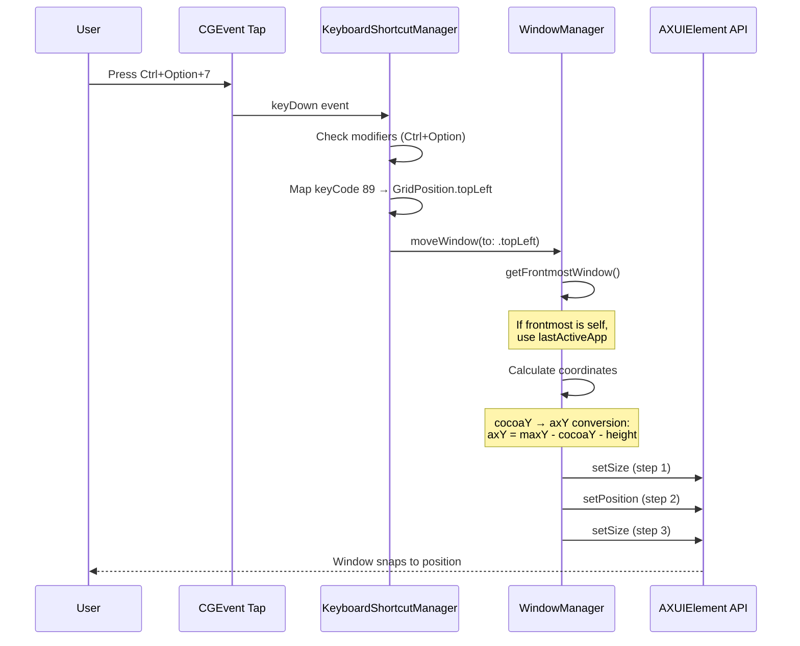
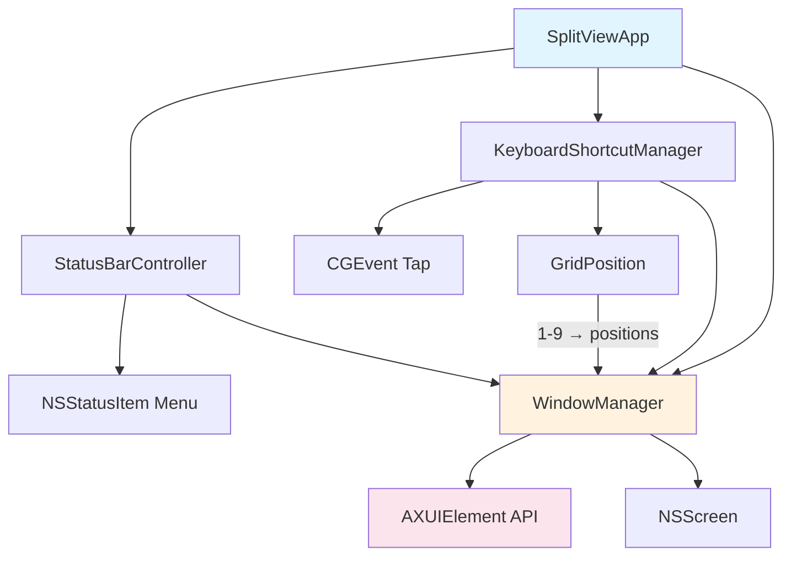

# CLAUDE.md

This file provides guidance to Claude Code (claude.ai/code) when working with code in this repository.

## Build Commands

```bash
# Build the app
xcodebuild -project SplitView.xcodeproj -scheme SplitView -configuration Debug build

# Clean and rebuild
xcodebuild -project SplitView.xcodeproj -scheme SplitView clean build

# Open in Xcode
open SplitView.xcodeproj
```

## Architecture

SplitView is a macOS menu bar app that snaps windows to a 3x3 grid using keyboard shortcuts.

### Program Flow



### Component Diagram



### Core Components

- **SplitViewApp.swift**: App entry point with AppDelegate. Sets activation policy to `.accessory` (menu bar only, no dock icon). Initializes StatusBarController and KeyboardShortcutManager.

- **WindowManager.swift**: Handles window positioning using macOS Accessibility API (AXUIElement). Tracks last active app to handle shortcuts correctly when SplitView becomes frontmost. Uses CGDisplay API for coordinate calculations.

- **KeyboardShortcutManager.swift**: Registers global hotkeys via CGEvent tap. Listens for `Ctrl+Option+[1-9]` (numpad layout). Requires accessibility permissions.

- **GridPosition.swift**: Enum mapping numpad positions (1-9) to screen grid positions. Numpad layout: 7=top-left, 8=top-center, 9=top-right, etc.

- **StatusBarController.swift**: NSStatusItem menu bar icon and dropdown menu. Shows accessibility permission status, grid position shortcuts, and quit option. Implements NSMenuDelegate to refresh status on menu open.

### Coordinate Systems

macOS uses two coordinate systems:
- **Cocoa (NSScreen)**: Origin at bottom-left, Y increases upward
- **Accessibility API**: Origin at top-left, Y increases downward

**Conversion formula:**
```swift
axY = primaryScreen.frame.maxY - cocoaY - windowHeight
```

**Why this works:**
- `primaryScreen.frame.maxY` = top of primary screen in Cocoa coords (e.g., 1080)
- Subtracting `cocoaY` flips the Y axis
- Subtracting `windowHeight` because AX position is top-left corner of window

**Setting window frame (Rectangle's 3-step approach):**
```swift
// 1. Set size first
AXUIElementSetAttributeValue(window, kAXSizeAttribute, size)
// 2. Set position
AXUIElementSetAttributeValue(window, kAXPositionAttribute, position)
// 3. Set size again (position change may affect allowed size)
AXUIElementSetAttributeValue(window, kAXSizeAttribute, size)
```

This handles macOS enforcing display-appropriate sizes when windows move between positions.

### Permissions

App requires:
- **Accessibility**: For moving/resizing windows via AXUIElement
- Add app to System Settings → Privacy & Security → Accessibility

Info.plist includes `LSUIElement=true` (menu bar app) and `NSAccessibilityUsageDescription`.
